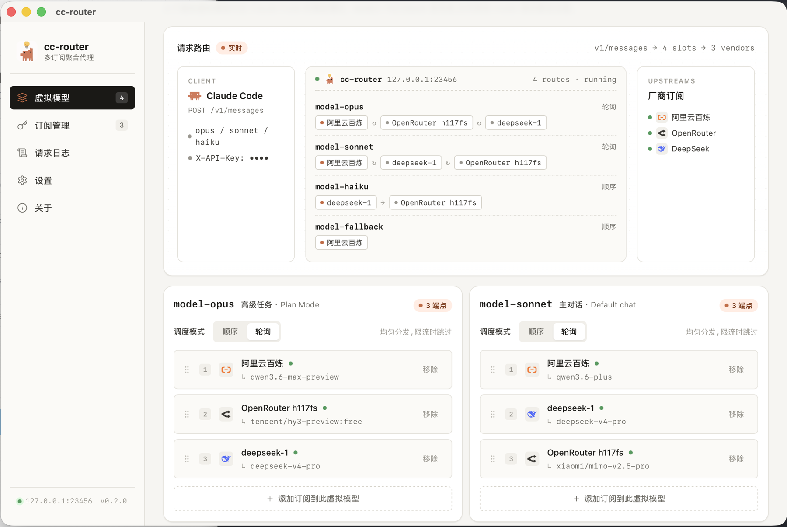
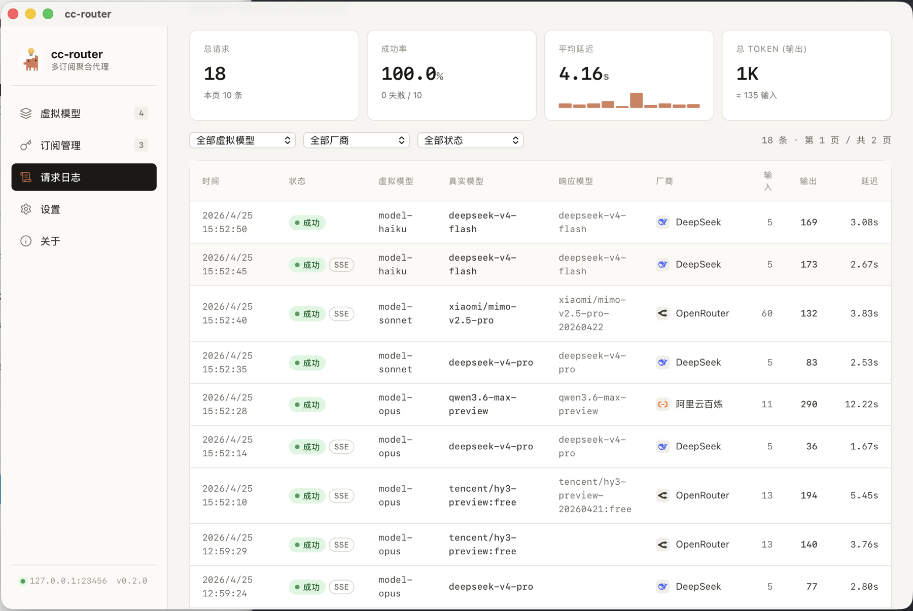

# cc-router

<figure align="center" markdown="span">
  { width="160" }
</figure>

  
  
  
  
  

Bought too many Claude Code subscriptions but stuck using only one? cc-router merges Token Plans, Coding Plans, and pay-as-you-go API quotas from DeepSeek, Qwen, Kimi, MiMo, MiniMax, Zhipu GLM, Anthropic, and more into a single virtual plan. Mix and match providers across the opus / sonnet / haiku slots, schedule them sequentially or round-robin, and let cc-router auto-failover on rate limits and errors — squeezing every quota down to the last token.

[:fontawesome-brands-github: GitHub Repo](https://github.com/finch-xu/cc-router){ .md-button }
[:material-download: Download Releases](https://github.com/finch-xu/cc-router/releases){ .md-button }

## Features

- **Multi-provider aggregation** — One config covers major LLM subscriptions and pay-as-you-go APIs (Zhipu, DeepSeek, Kimi, MiniMax, Alibaba Bailian, Volcengine, Tencent Cloud, Xiaomi MiMo, OpenRouter, Fireworks, ModelScope, Ollama, and more)
- **Three-slot virtual model** — Map any real model to Claude Code's opus / sonnet / haiku slots
- **Smart scheduling** — Call multiple subscriptions sequentially or round-robin, with automatic failover on rate limits and errors
- **Local proxy** — Listens on `127.0.0.1:23456` after launch; zero cloud dependency, API keys never leave your machine
- **Onboarding wizard** — On first launch, automatically fetches model lists and generates Claude Code env config in one click

## Screenshots

<figure align="center" markdown="span">
  { width="900" }
  <figcaption>Virtual model configuration: bind multiple real models to the opus / sonnet / haiku slots</figcaption>
</figure>

<figure align="center" markdown="span">
  { width="900" }
  <figcaption>Request log: watch Claude Code request routing in real time</figcaption>
</figure>

## Quick Links

- [Getting Started](getting-started.md) — Download, install, and connect to Claude Code
- [GitHub](https://github.com/finch-xu/cc-router) — Source code and releases
