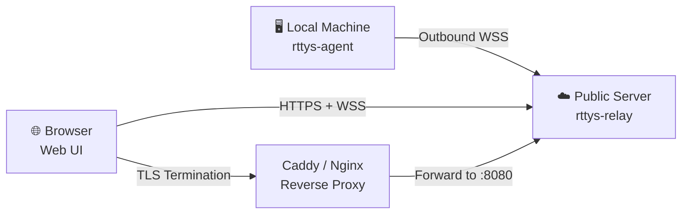

# Deployment

## Public Network Deployment

With public network deployment, you can remotely access the terminal on your home Mac from any device with a browser. The overall architecture is as follows:



!!! warning "Security Reminder"

    Public deployment **must** use a reverse proxy with HTTPS, otherwise all terminal data will be transmitted in plaintext. [Caddy](https://caddyserver.com/) is recommended for automatic certificate management.

### Prerequisites

- [x] A server with a public IP (or configured domain resolution)
- [x] Docker and Docker Compose installed
- [x] A domain name resolved to the server (e.g. `rttys.example.com`)
- [x] Ports `80/tcp`, `443/tcp`, and `443/udp` open on the server, for Caddy TLS certificate issuance, HTTPS access, and HTTP/3 respectively.

### Step 1: Pull Images

```bash
git clone https://github.com/finch-xu/RemoteTTYs.git
cd RemoteTTYs

docker pull ghcr.io/finch-xu/remotettys:latest
docker pull caddy:2-alpine
```

If you are in mainland China, you can use mirror acceleration:

```bash
docker pull ghcr.1ms.run/finch-xu/remotettys:latest
docker tag ghcr.1ms.run/finch-xu/remotettys:latest ghcr.io/finch-xu/remotettys:latest

docker pull docker.1ms.run/caddy:2-alpine
docker tag docker.1ms.run/caddy:2-alpine caddy:2-alpine
```

### Step 2: Configure Reverse Proxy

=== "Caddy (Recommended)"

    Caddy automatically requests and renews Let's Encrypt certificates, making configuration extremely simple.

    ```bash
    cp Caddyfile.example Caddyfile
    ```

    Replace `rttys.example.com` in the file with your actual domain (already resolved to this machine).

    !!! tip "Why Caddy?"

        Caddy supports automatic HTTPS out of the box — no manual certificate paths or renewal cron jobs. For personal projects, this eliminates significant ops overhead.

=== "Nginx"

    Nginx requires you to manage SSL certificates yourself (e.g. via certbot).
    Configuration not available yet.

### Step 3: Start the Service

Start the `docker compose` service with one command.

```bash
# Start the service
docker compose up -d

# View server logs
docker compose logs -f --tail 1000

# Stop the service
docker compose down
```

### Step 3: Initialize Admin Account

After the reverse proxy is configured, visit `https://rttys.example.com` in your browser.

On first visit, you'll be guided through a **Setup page** to create your admin account.

!!! warning "One-time Initialization"

    The Setup page only appears when there are no users in the system. After creating the admin account, it is automatically disabled. Additional users must be added by the admin in Settings.

!!! warning "Important!!!"

    Always use a strong, complex password for user accounts.

### Step 4: Install Agent

The Agent is a single-file Go program that runs on your local machine and establishes an outbound connection to the server.

#### Download

Go to the [Releases](https://github.com/finchxu/RemoteTTYs/releases) page and download the binary for your platform:

| Platform | File |
|----------|------|
| macOS (Apple Silicon) | `rttys-agent-macOS-arm64` |
| macOS (Intel) | `rttys-agent-macOS-x64` |
| Linux (x86_64) | `rttys-agent-Linux-x64` |
| Linux (ARM64) | `rttys-agent-Linux-arm64` |

```bash
chmod +x rttys-agent-*
mv rttys-agent-* rttys-agent
```

#### Initialize Configuration

```bash
./rttys-agent init
```

This creates `config.yaml` in the same directory as the binary:

```yaml title="config.yaml"
relay: wss://rttys.example.com/ws/agent # (1)!
token: your-agent-token                 # (2)!
server_key: <base64-ed25519-public-key> # (3)!
name: my-machine
shell: /bin/zsh
```

1. Public deployment uses the `wss://` protocol. Replace the domain with your actual domain.
2. Create an Agent Token on the **Settings** page of the Web UI and paste it here.
3. Copy the server's `Server Public Key` (Ed25519) from the **Settings** page. The agent uses it to verify server identity.

#### Start

```bash
./rttys-agent        # Foreground, for debugging
./rttys-agent -d     # Daemon mode (logs to ~/.rttys/agent.log)
./rttys-agent status # Check running status
./rttys-agent stop   # Stop daemon
```

!!! tip "Auto-reconnect"

    The agent has a built-in exponential backoff reconnect mechanism (1s → 30s cap). No manual intervention needed during network fluctuations.

### Deployment Checklist

After completing the steps above, use this checklist to confirm everything is ready:

- [x] Server started via `docker compose up -d`
- [x] Reverse proxy configured with HTTPS, pointing to `:8080`
- [x] Web UI accessible via `https://your-domain` in browser
- [x] Admin account created
- [x] Agent Token generated in Web UI
- [x] Local machine's `config.yaml` has correct `relay`, `token`, and `server_key`
- [x] Agent is running and shows as online in the Web UI dashboard

## LAN Deployment

<!-- TODO: Write LAN deployment content here -->
