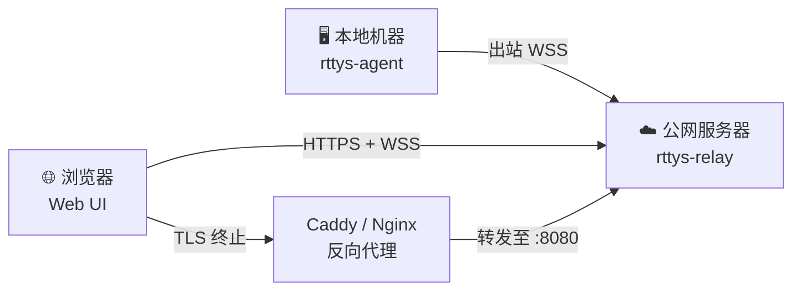

# 部署方式

## 公网部署

通过公网部署，你可以从任何有浏览器的设备远程访问家中 Mac 的终端。整体架构如下：



!!! warning "安全提醒"

    公网部署**必须**使用反向代理配置 HTTPS，否则所有终端数据将以明文传输。推荐使用 [Caddy](https://caddyserver.com/) 自动管理证书。

### 前置条件

- [x] 一台有公网 IP 的服务器（或已配置域名解析）
- [x] 已安装 Docker 和 Docker Compose
- [x] 一个已解析到服务器的域名（如 `rttys.example.com`）
- [x] 服务器已开启`80/tcp``443/tcp``443/udp`三个端口，分别用于 caddy tls 证书申请、https 访问端口、h3 端口。

### 第一步：拉取镜像

```bash
git clone https://github.com/finch-xu/RemoteTTYs.git
cd RemoteTTYs

docker pull ghcr.io/finch-xu/remotettys:latest
docker pull caddy:2-alpine
```

如果你在中国大陆，可以使用镜像加速

```bash
docker pull ghcr.1ms.run/finch-xu/remotettys:latest
docker tag ghcr.1ms.run/finch-xu/remotettys:latest ghcr.io/finch-xu/remotettys:latest

docker pull docker.1ms.run/caddy:2-alpine
docker tag docker.1ms.run/caddy:2-alpine caddy:2-alpine
```

### 第二步：配置反向代理

=== "Caddy（推荐）"

    Caddy 会自动申请和续期 Let's Encrypt 证书，配置最为简单。

    ```bash
    cp Caddyfile.example Caddyfile
    ```

    修改文件内的`rttys.example.com`为你的真实域名（已解析到此机器）。

    !!! tip "为什么推荐 Caddy"

        Caddy 开箱即用支持自动 HTTPS，无需手动配置证书路径、定时续期等。对于个人项目来说，这省去了大量运维工作。

=== "Nginx"

    使用 Nginx 需要自行管理 SSL 证书（如通过 certbot）。    
    暂时没有配置。    

### 第三步：启动服务

一键启动`docker compose`服务。

```bash
# 启动服务
docker compose up -d

# 查看服务器日志
docker compose logs -f --tail 1000

# 关闭服务
docker compose down
```

### 第三步：初始化管理员账号

反向代理配置完成后，用浏览器访问 `https://rttys.example.com`。

首次访问会进入 **Setup 页面**，按提示创建管理员账号即可。

!!! warning "初始化仅一次"

    Setup 页面只在系统没有任何用户时出现。创建管理员后，该页面将自动禁用，后续用户需要由管理员在设置中添加。    
    

!!! warning "注意！！！"

    用户密码请务必使用强复杂度。


### 第四步：安装 Agent

Agent 是运行在本地机器上的单文件 Go 程序，负责与服务器建立出站连接。

#### 下载

前往 [Releases](https://github.com/finchxu/RemoteTTYs/releases) 页面下载对应平台的二进制文件：

| 平台 | 文件名 |
|------|--------|
| macOS (Apple Silicon) | `rttys-agent-macOS-arm64` |
| macOS (Intel) | `rttys-agent-macOS-x64` |
| Linux (x86_64) | `rttys-agent-Linux-x64` |
| Linux (ARM64) | `rttys-agent-Linux-arm64` |

```bash
chmod +x rttys-agent-*
mv rttys-agent-* rttys-agent
```

#### 初始化配置

```bash
./rttys-agent init
```

这会在二进制文件同目录下生成 `config.yaml`：

```yaml title="config.yaml"
relay: wss://rttys.example.com/ws/agent # (1)!
token: your-agent-token                 # (2)!
server_key: <base64-ed25519-public-key> # (3)!
name: my-machine
shell: /bin/zsh
```

1. 公网部署使用 `wss://` 协议，域名替换为你的实际域名。
2. 在 Web UI 的 **Settings** 页面创建 Agent Token，复制粘贴到这里。
3. 在 **Settings** 页面复制服务器`Server Public Key`的 Ed25519 公钥，Agent 用它验证服务器身份。

#### 启动

```bash
./rttys-agent        # 前台运行，用于调试
./rttys-agent -d     # 后台启动，守护进程模式（日志写入 ~/.rttys/agent.log）
./rttys-agent status # 查看运行状态
./rttys-agent stop   # 停止守护进程
```

!!! tip "断线自动重连"

    Agent 内置指数退避重连机制（1s → 30s），网络波动时无需手动干预。

### 部署清单

完成以上步骤后，用这个清单确认一切就绪：

- [x] 服务端通过 `docker compose up -d` 启动
- [x] 反向代理已配置 HTTPS 并指向 `:8080`
- [x] 浏览器能通过 `https://域名` 访问 Web UI
- [x] 管理员账号已创建
- [x] Agent Token 已在 Web UI 中生成
- [x] 本地机器的 `config.yaml` 填写了正确的 `relay`、`token`、`server_key`
- [x] Agent 已启动并在 Web UI 的仪表盘中显示为在线

## 局域网部署

<!-- TODO: 在此编写局域网部署内容 -->
