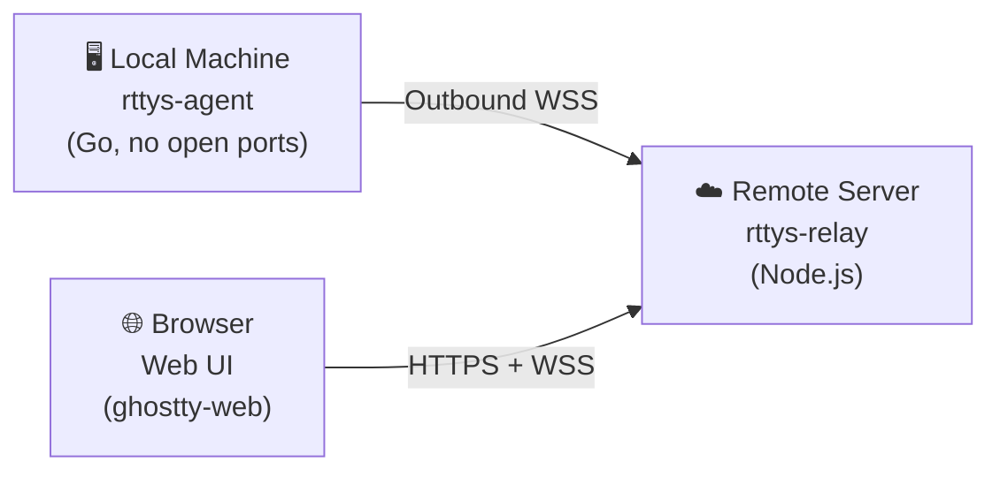

# RemoteTTYs

<figure align="center" markdown="span">
  { width="300" }
</figure>

<p align="center">
  <a href="https://github.com/finch-xu/RemoteTTYs/blob/main/LICENSE"></a>
  
  
  
  
  
</p>

Remotely access the terminal on your home Mac from a browser, no NAT traversal needed. Run Claude Code, Codex, vim, or any CLI tool and command directly.

[:fontawesome-brands-github: GitHub Repository](https://github.com/finch-xu/RemoteTTYs){ .md-button }
[](https://deepwiki.com/finch-xu/RemoteTTYs){ .md-button }

!!! warning "Notice"

    This project is for personal use and experimentation only — do **NOT** deploy it in production environments. You are solely responsible for securing your own data and connections. When exposing the relay to the public internet, always use a reverse proxy with HTTPS (e.g. [Caddy](https://caddyserver.com/)) to encrypt all traffic.

## How It Works



- **Agent** runs on your local machines and connects outbound to the relay — no open ports, no NAT traversal needed
- **Relay** routes messages between agents and browsers without ever reading terminal content
- **Web UI** renders terminals using [ghostty-web](https://github.com/coder/ghostty-web) (Ghostty's VT100 parser compiled to WebAssembly)

## Features

- Multiple machines in one dashboard with online/offline status
- Multiple terminal sessions per machine with tabs
- Scrollback replay on browser reconnect (1MB buffer per session)
- Multi-user authentication with JWT (httpOnly cookie + CSRF protection)
- Agent token management for machine authorization
- Ed25519 challenge-response for server identity verification
- Machine fingerprint binding to prevent token reuse across machines
- Audit logging (login, connections, session lifecycle)
- Single Go binary agent — zero dependencies on target machines
- Daemon mode with auto-reconnect (exponential backoff)

## Security Model

The agent-to-server connection is protected by three layers:

1. **Token authentication at HTTP layer** — the agent sends its token in the `X-Token` HTTP header during WebSocket upgrade. Invalid tokens are rejected before the WebSocket connection is established.
2. **Ed25519 challenge-response** — after the WebSocket is established, the server signs the agent's token with its Ed25519 private key and sends it as a challenge. The agent verifies the signature using the pre-configured server public key. Data is only sent after verification passes.
3. **Machine fingerprint binding** — the agent reports a SHA-256 hash of the machine's unique ID. The server records it on first connection and rejects mismatches on subsequent connections, preventing token reuse on different machines.

## Project Structure

```
remotettys/
├── agent/              # Go — local agent binary
├── packages/
│   ├── relay/          # TypeScript — WebSocket relay + REST API
│   └── web/            # React + Vite — browser terminal UI
├── Dockerfile          # Multi-stage build for server
├── docker-compose.yml  # Production deployment
├── Makefile            # Build all components
└── package.json        # npm workspaces
```
