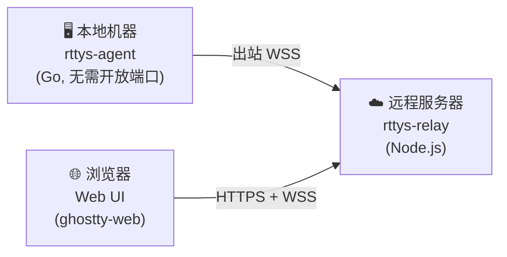

# RemoteTTYs

<figure align="center" markdown="span">
  { width="300" }
</figure>

<p align="center">
  <a href="https://github.com/finch-xu/RemoteTTYs/blob/main/LICENSE"></a>
  
  
  
  
  
</p>

从浏览器远程访问家中 Mac 的终端，无需 NAT 穿透。直接运行 Claude Code、Codex、vim 或任何 CLI 工具和命令。

[:fontawesome-brands-github: GitHub 仓库](https://github.com/finch-xu/RemoteTTYs){ .md-button }
[](https://deepwiki.com/finch-xu/RemoteTTYs){ .md-button }

!!! warning "注意"

    本项目仅供个人使用和实验——**请勿**在生产环境中部署。数据和连接的安全性由你自行负责。将 Relay 暴露到公网时，务必使用反向代理配置 HTTPS（如 [Caddy](https://caddyserver.com/)）来加密所有流量。

## 工作原理



- **Agent** 运行在本地机器上，主动向 Relay 发起出站连接——无需开放端口，无需 NAT 穿透
- **Relay** 在 Agent 和浏览器之间路由消息，不会读取终端内容
- **Web UI** 使用 [ghostty-web](https://github.com/coder/ghostty-web)（Ghostty 的 VT100 解析器编译为 WebAssembly）渲染终端

## 特性

- 单一仪表盘管理多台机器，显示在线/离线状态
- 每台机器支持多个终端会话，标签页切换
- 浏览器重连时回放滚动缓冲区（每个会话 1MB 缓冲）
- JWT 多用户认证（httpOnly cookie + CSRF 保护）
- Agent Token 管理，用于机器授权
- Ed25519 挑战-响应验证服务器身份
- 机器指纹绑定，防止 Token 在不同机器间被盗用
- 审计日志（登录、连接、会话生命周期）
- Agent 为单一 Go 二进制文件——目标机器零依赖
- 守护进程模式，支持自动重连（指数退避）

## 安全模型

Agent 与服务器之间的连接由三层保护：

1. **HTTP 层 Token 认证** —— Agent 在 WebSocket 升级时通过 `X-Token` HTTP 头发送 Token，无效 Token 在 WebSocket 连接建立前即被拒绝
2. **Ed25519 挑战-响应** —— WebSocket 建立后，服务器用 Ed25519 私钥签名 Agent 的 Token 作为挑战，Agent 使用预配置的服务器公钥验证签名，验证通过后才发送数据
3. **机器指纹绑定** —— Agent 上报机器唯一 ID 的 SHA-256 哈希，服务器在首次连接时记录，后续连接不匹配则拒绝，防止 Token 在不同机器上被冒用

## 项目结构

```
remotettys/
├── agent/              # Go — 本地 Agent 二进制
├── packages/
│   ├── relay/          # TypeScript — WebSocket 中继 + REST API
│   └── web/            # React + Vite — 浏览器终端 UI
├── Dockerfile          # 多阶段构建（服务端）
├── docker-compose.yml  # 生产部署
├── Makefile            # 构建所有组件
└── package.json        # npm workspaces
```
